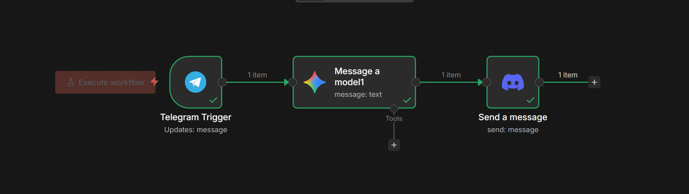
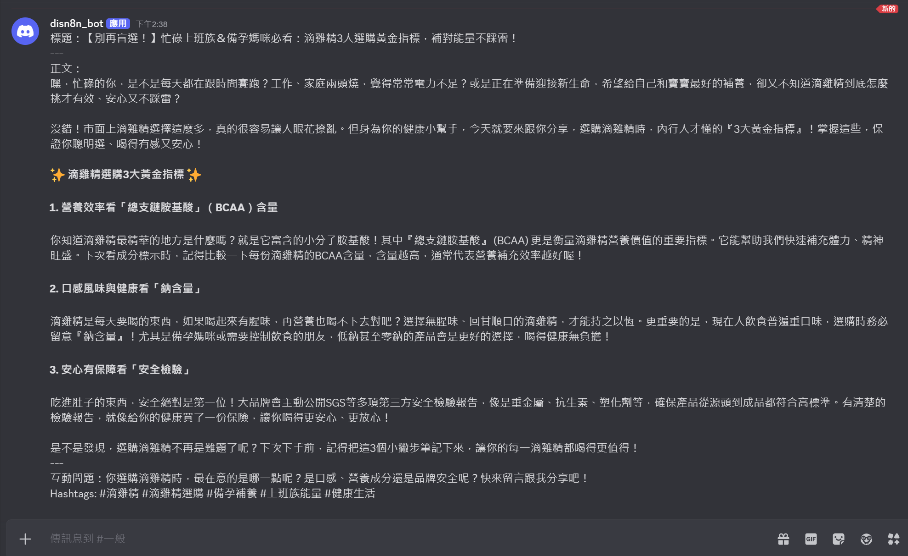
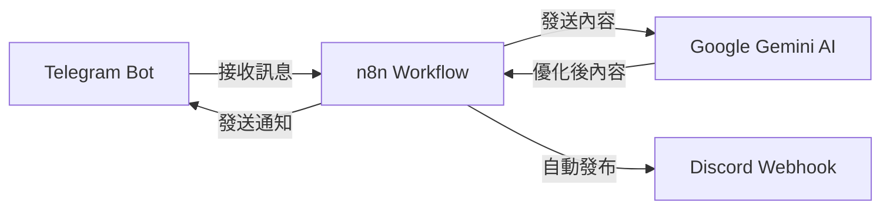

# AI 驅動社群自動化系統

> 使用 n8n、Telegram Bot 與 Google Gemini AI 打造的跨平台社群內容自動發布系統

[](https://n8n.io)
[](https://telegram.org)
[](https://ai.google.dev)

## 📖 專案簡介

本專案專為「市場研究與社群經營」設計。整合 **n8n 工作流程自動化**、**Telegram Bot API** 與 **Google Gemini AI** 將專業的市場調查關鍵字（如：滴雞精、保健食品趨勢）即時轉化為高品質、可直接發布於 Facebook 與 Threads 的社群文案（目前支援 Discord人工審核）。

### 💡 核心價值
- **數據轉化**：模擬專業市場分析師，將硬核調查數據轉化為有溫度的社群語言。
- **效率優化**：減少從「市場發現」到「內容產出」之間的溝通成本。
- **跨平台協作**：Telegram 接收指令，AI 處理內容，Discord 團隊審核，實現無縫工作流。

---

## 📖 演示案例：滴雞精市場洞察
為了展示本系統在專業領域的應用，我們預設了「滴雞精」作為情境背景：

1. **輸入關鍵字**：`滴雞精選購要點`
2. **AI 處理邏輯**：
   - 帶入專業背景（BCAA 含量、鈉含量、SGS 檢驗）。
   - 針對目標受眾（上班族、備孕女性）撰寫標題。
   - 自動生成 2-3 個精準 Hashtag 與互動提問。
3. **輸出結果**：結構化的社群貼文，包含「標題、正文、互動問題、Hashtags」。

---

## 🎬 展示

### Workflow 架構


### 輸入範例（Telegram）


### 輸出結果（Discord）


## 🛠️ 技術架構



### 使用技術

- **自動化平台**: n8n
- **聊天機器人**: Telegram Bot API
- **AI 模型**: Google Gemini 2.5 Flash
- **發布平台**: Discord Webhook
- **替代方案**: Ollama（地端模型）

## 🚀 快速開始

### 前置需求

- n8n（本地安裝或 n8n Cloud）
- Telegram Bot Token
- Google Gemini API Key
- Discord Webhook URL

### 安裝步驟

1. **Clone 此專案**
   ```bash
   git clone https://github.com/YOUR_USERNAME/social-media-automation.git
   cd social-media-automation
   ```

2. **匯入 n8n Workflow**
   - 開啟 n8n
   - 點擊「Import from File」
   - 選擇 `workflows/telegram-discord-ai.json`

3. **設定 Credentials**
   
   在 n8n 中設定以下憑證：
   
   - **Telegram Bot**: 
     - 向 [@BotFather](https://t.me/botfather) 建立 Bot 並取得 Token
     - 在 n8n 新增 Telegram credential
   
   - **Google Gemini API**:
     - 前往 [Google AI Studio](https://aistudio.google.com/app/apikey)
     - 建立 API Key
     - 在 n8n HTTP Request 節點中設定
   
   - **Discord Webhook**:
     - 在 Discord 頻道設定 > 整合 > Webhook
     - 複製 Webhook URL
     - 在 n8n Discord 節點中貼上

4. **啟動 Workflow**
   - 點擊 「Active」 開關
   - 在 Telegram 發送訊息測試

### 詳細設定說明

請參考 [Setup Guide](docs/setup-guide.md)

## 📋 使用方式

1. 在 Telegram 與您的 Bot 開啟對話
2. 發送任何關鍵字或內容（例如：「貓」、「科技趨勢」）
3. Bot 會自動：
   - 使用 AI 擴展並優化內容
   - 加入適合的 hashtag
   - 發布到 Discord
4. 可在 n8n 的 Executions 查看執行記錄

## 🎯 應用場景

- ✅ 社群媒體內容快速發布
- ✅ 多平台內容同步
- ✅ AI 輔助內容創作
- ✅ 自動化社群營運工作流程
- ✅ 內容風格一致性管理

## 🔧 進階功能

### 可擴展的平台

- Twitter/X
- Facebook
- Instagram
- Threads
- LinkedIn

### 計畫中的功能

- [ ] 內容排程發布
- [ ] 數據追蹤與分析
- [ ] 多語系內容生成
- [ ] 圖片自動生成與發布
- [ ] RSS 自動監控與發布

## 📊 專案統計

- **開發時間**: 2 天
- **Workflow 節點數**: 4 個
- **支援平台**: 2 個（Telegram、Discord）
- **AI 模型**: Google Gemini 2.5 Flash
- **成本**: 完全免費

## 🤝 貢獻

歡迎提出 Issue 或 Pull Request！

## 📄 授權

MIT License

## 👤 作者

**張淨雅 (Ching-Ya Chang)**

- Email: cc1799999@gmail.com
- GitHub: [@YOUR_USERNAME](https://github.com/YOUR_USERNAME)

## 🙏 致謝

- [n8n](https://n8n.io) - 強大的工作流程自動化工具
- [Google Gemini](https://ai.google.dev) - 優秀的 AI 模型
- [Telegram](https://telegram.org) - 穩定的 Bot 平台

---

⭐ 如果這個專案對您有幫助，歡迎給個 Star！
